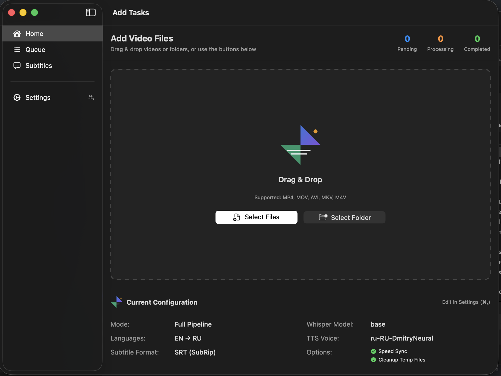
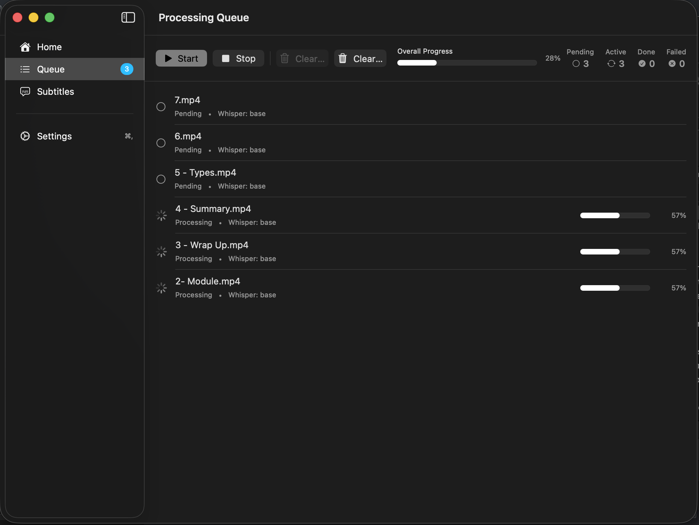
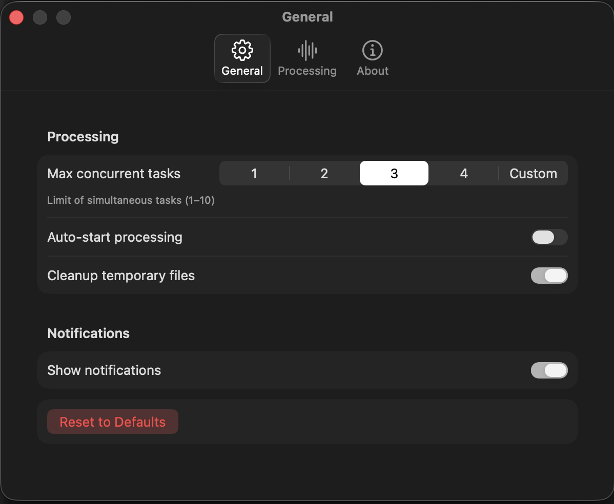
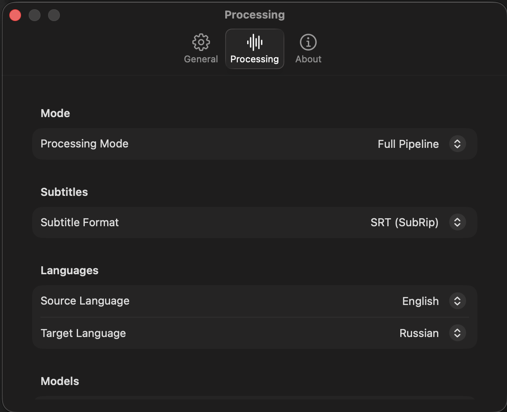

# 🎬 SubDubAI - Automatic Video Dubbing with AI

**SubDubAI** is a powerful macOS application that automatically translates videos, generates voiceovers, and creates dubbed content with time synchronization. The application uses cutting-edge AI technologies for video processing.

## ✨ Key Features

### 🎯 Complete Video Processing Pipeline:

1. **📹 Audio Extraction** - Automatic audio extraction from video files
2. **🗣️ Transcription** - Speech-to-text conversion with word-level accuracy
3. **🌍 Translation** - Automatic text translation to target language
4. **📝 Subtitles** - Generation of synchronized subtitles (SRT, VTT, ASS)
5. **🎙️ Speech Synthesis** - Voiceover generation in target language
6. **🔊 Audio Assembly** - Combining voiceovers with pauses and synchronization
7. **🎬 Video Composition** - Creating final video with dubbing and subtitles

### 🎮 User Interface:

- **Task Queue** - Manage multiple videos simultaneously
- **Progress Tracking** - Detailed information about each processing stage
- **Preset Configuration** - Language, voice, and subtitle format selection
- **Batch Processing** - Process folders with multiple videos
- **Concurrency Control** - Control number of simultaneously processed tasks

## 📸 Screenshots

### Main Interface


### Task Queue


### Settings - General


### Settings - Processing


## 🤖 AI and APIs Used

### Core AI Services:

| Component | Technology | Purpose |
|-----------|-----------|---------|
| **Transcription** | [WhisperKit](https://github.com/argmax-ai/WhisperKit) | High-accuracy speech-to-text conversion |
| **Translation** | [macOS Translation Framework](https://developer.apple.com/documentation/translation) | Built-in text translation between languages |
| **Speech Synthesis** | [edge-tts](https://github.com/rany2/edge-tts) | Natural-sounding voiceover generation |
| **Video Processing** | [FFmpeg](https://ffmpeg.org/) | Audio extraction, assembly, and video composition |

### Supported Languages:

- English (en)
- Russian (ru)
- Spanish (es)
- French (fr)
- German (de)
- Italian (it)
- Portuguese (pt)
- Japanese (ja)
- Chinese (zh)
- And many more...

## 🛠️ Technology Stack

### Frameworks and Libraries:

- **SwiftUI** - Modern UI framework for macOS
- **Combine** - Reactive programming
- **Swift Concurrency** - Asynchronous programming (async/await, actors)
- **Foundation** - Core APIs for file and network operations

### Architecture:

- **Clean Architecture** - Separation into Domain, Data, and Presentation layers
- **MVVM** - Model-View-ViewModel pattern for UI
- **Repository Pattern** - Data access abstraction
- **Use Cases** - Business logic layer
- **Dependency Injection** - Dependency management

### Key Components:

- **TTSService** - Voiceover generation with concurrency management
- **AudioAssemblyService** - Audio file assembly with synchronization
- **TranscriptionService** - WhisperKit integration
- **TranslationService** - Text translation
- **ShellService** - System command execution (ffmpeg, edge-tts)
- **TaskQueue** - Task queue and concurrency management

## 📋 System Requirements

### Dependencies:

```bash
# FFmpeg - for video and audio processing
brew install ffmpeg

# edge-tts - for speech synthesis (installed automatically)
pip install edge-tts
```

### System Requirements:

- macOS 12.0 or higher
- 8 GB RAM (16 GB recommended)
- 5-10 GB free disk space (for models and cache)
- Internet connection (for initial model download)

## 🚀 Quick Start

### 1. Install Dependencies:

```bash
# Install FFmpeg
brew install ffmpeg

# Install edge-tts
pip install edge-tts
```

### 2. Run the Application:

```bash
# Open project in Xcode
open SubDubAI.xcodeproj

# Build and run (⌘R)
```

### 3. Process Video:

1. Click "+" button to add video
2. Select video file or folder
3. Choose source and target languages
4. Select voiceover voice
5. Click "Start Processing"
6. Monitor progress in task queue

## 📁 Project Structure

```
SubDubAI/
├── SubDubAI/
│   ├── Core/
│   │   ├── Domain/
│   │   │   ├── Entities/          # Data models
│   │   │   ├── Repositories/      # Repository interfaces
│   │   │   └── UseCases/          # Business logic
│   │   └── Data/
│   │       └── Repositories/      # Repository implementations
│   ├── Features/
│   │   ├── Queue/                 # Task queue UI
│   │   ├── Settings/              # Application settings
│   │   └── Details/               # Task details
│   ├── Services/
│   │   ├── TTSService.swift       # Speech synthesis
│   │   ├── TranscriptionService.swift
│   │   ├── TranslationService.swift
│   │   ├── AudioAssemblyService.swift
│   │   ├── ShellService.swift
│   │   └── ...
│   ├── Shared/
│   │   ├── State/                 # State management
│   │   └── Extensions/            # Extensions
│   └── Models/
│       └── ...                    # Data models
├── Input/                         # Input video files
├── Output/                        # Processing results
└── README.md
```

## ⚙️ Configuration

Main settings available in the application interface:

- **Max Concurrent Tasks** - System load control (1-4)
- **Source Language** - Original video language
- **Target Language** - Dubbing target language
- **TTS Voice** - Voiceover voice selection
- **Subtitle Format** - SRT, VTT, or ASS
- **Speed Sync** - Automatic voiceover speed adjustment
- **Cleanup Temp Files** - Remove intermediate files after processing

## 🎯 Implementation Features

### Concurrency Management:

- **ConcurrencyLimiter** - Actor for limiting concurrent operations
- **Maximum 2 simultaneous TTS generations** - Prevents system overload
- **Per-segment timeout** - 90 seconds for voiceover generation
- **Retry with exponential backoff** - Automatic retries on errors

### Streaming Processing:

- **Real-time progress** - UI updates during processing
- **FFmpeg progress parsing** - Audio assembly progress tracking
- **Asynchronous processing** - Non-blocking operations using async/await

### Error Handling:

- **Detailed logging** - Information about each processing stage
- **Graceful degradation** - Continue on partial errors
- **Crash recovery** - Ability to restart tasks

## 📊 Performance

### Typical Processing Times (for 1-hour video):

- **Audio Extraction**: 2-5 sec
- **Transcription**: 10-30 min (depends on hardware)
- **Translation**: 1-3 min
- **Voiceover Generation**: 5-15 min
- **Audio Assembly**: 1-2 min
- **Video Composition**: 5-10 min

**Total Time**: 30-60 minutes depending on video length and computer power

## 🔧 Troubleshooting

### Error: "ffmpeg not found"

```bash
brew install ffmpeg
```

### Error: "edge-tts not found"

```bash
pip install edge-tts
```

### Slow Transcription

- Close other applications to free up memory
- Use shorter videos for testing
- Verify WhisperKit model is loaded (~1.5GB)

### Translation Issues

- Check internet connection
- Verify correct languages are selected
- Restart the application

## 🎓 Architectural Decisions

### Swift Concurrency:

- Using `async/await` for asynchronous operations
- `Actor` for thread-safe state access
- `@MainActor` for UI updates
- `TaskGroup` for managing parallel tasks

### Reactive Programming:

- `@Published` for reactive properties
- `ObservableObject` for state management
- Combine for event processing

### Type Safety:

- Strict typing of all components
- Using `Sendable` for thread safety
- Minimizing `Any` and force unwrap usage

## 📝 License

MIT License - see LICENSE file

## 🤝 Contributing

Pull requests and issues are welcome!

## 📞 Support

For questions and suggestions, please create an issue in the repository.

---

**Last Updated**: November 2025
